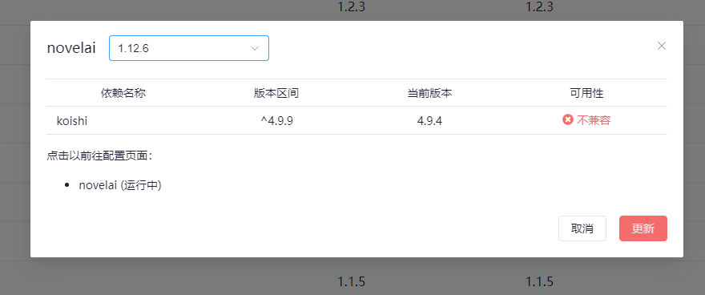

import { FaqPre, FaqPost } from '@site/src/components/FaqCardList'

<FaqPre />

你需要先升级不兼容的依赖。

如上图，提示「不兼容」的依赖为 `koishi`，那么你就需要先找到 `koishi`，点击「修改」，并将其升级到最新版本。

如果升级依赖的时候也遇到了「不兼容」，那么你就需要先升级依赖的依赖。

大部分情况下，升级 `koishi` 到最新版即可解决问题。

<FaqPost />
