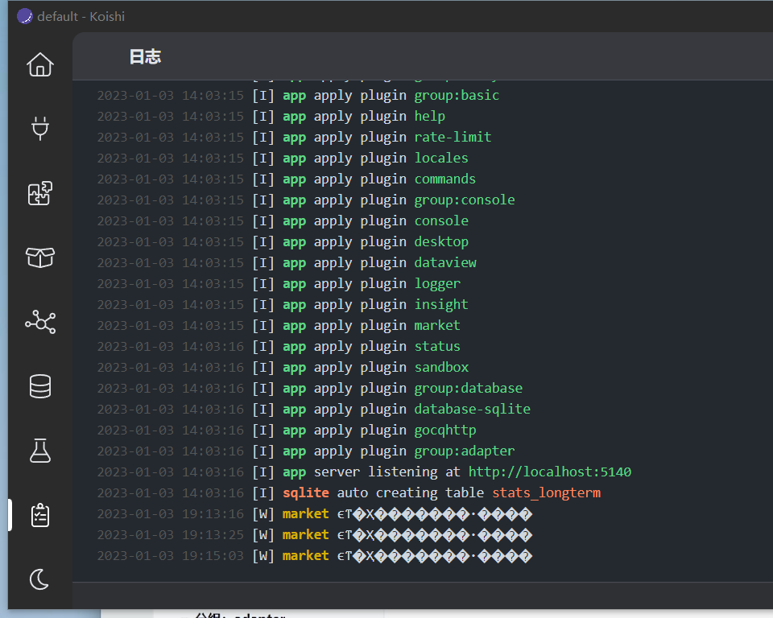
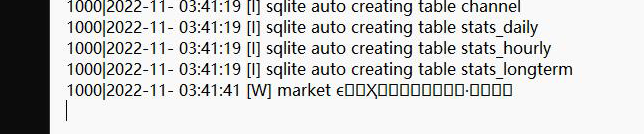
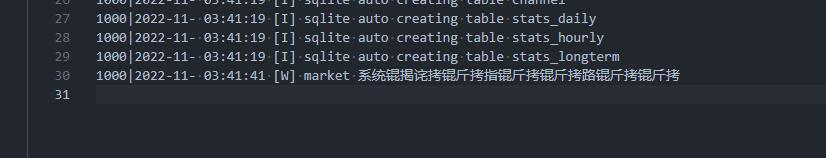

import { FaqPre, FaqPost } from '@site/src/components/FaqCardList'

<FaqPre />

如果你在 Windows 上尝试安装 Koishi 插件时遇到 Koishi
直接显示「安装失败」的情况，那么这可能是由于你的电脑环境故障所致。

首先，你需要排查是否为电脑环境故障引起了此问题。点击 Koishi
控制台左侧的「日志」选项卡，然后查看日志中是否有类似下方的输出：

如果有，那么确实为你的电脑环境故障所致。使用「[一键安装脚本](/platform/win/onekey)」可以解决此问题。

如果没有，那么是其他原因导致了插件安装的问题。你需要向社区提问。

<FaqPost />
