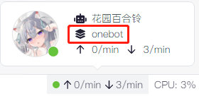
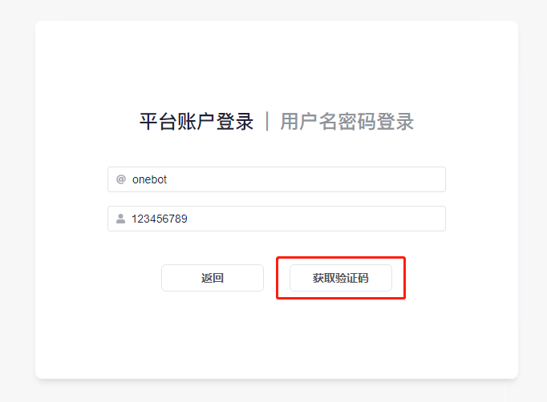

import { FaqPre, FaqPost } from '@site/src/components/FaqCardList'

<FaqPre />

你启用了 `auth` 插件。

首先，你可以单击右侧的`用户名密码登录`，使用可能内置的初始账号：「账号：`admin` 密码：`123456`」尝试登录。

如果初始账号无法登录，则单击左侧的`平台账户登录`，填入`平台名`与`账号`后单击获取验证码。

`平台名`为bot运行的平台名称，可以在右下角bot运行信息中获得。

`账号`为你的账号（而非bot的），要求具有4级或以上权限。

以下以onebot平台举例。

若你的填写无误，单击`获取验证码`后将会进入平台账户登录页面。

将`验证码`私聊发送至任意正在运行中的机器人（右下角运行中的bot之一），若操作无误，将会自动登录，并跳转至`用户资料`页面。

现在，你已经登录成功了！

你可以手动输入你想要的`用户名`与`密码`，单击右上角的`应用更改`，刷新页面，此时你已经可以使用右侧的`用户名密码登录`了。

如果上述登录都失败了，则需要按照「[如何手动停用插件？](/faq/7)」中的方法手动停用 `auth` 插件。

<FaqPost />
