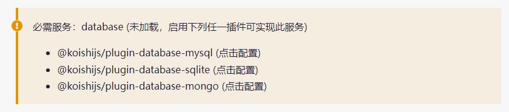

import { FaqPre, FaqPost } from '@site/src/components/FaqCardList'

<FaqPre />

你所使用的插件需要数据库才能运行。使用「[如何启用插件？](/faq/3)」中的方法添加并启用一个数据库插件。

如果你正在使用 Koishi Desktop 或 Koishi Android，那么直接添加并启用 `database-sqlite` 插件即可，无需进行任何配置。

如果你熟悉 MySQL 或 MongoDB，则可以添加对应的插件并连接到你的数据库。

<FaqPost />
