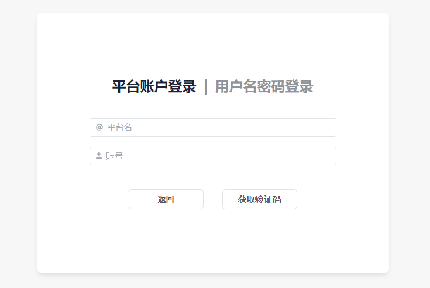

import { FaqPre, FaqPost } from '@site/src/components/FaqCardList'

<FaqPre />

你启用了 `auth` 插件。

如果你的 `auth` 插件较新，则可能已经内置了初始账号；你可以使用「账号：`admin` 密码：`123456`」尝试登录。

如果初始账号无法登录，则需要按照「[如何手动停用插件？](/faq/7)」中的方法手动停用 `auth` 插件。

<FaqPost />
