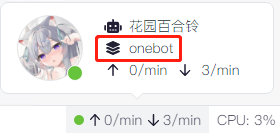
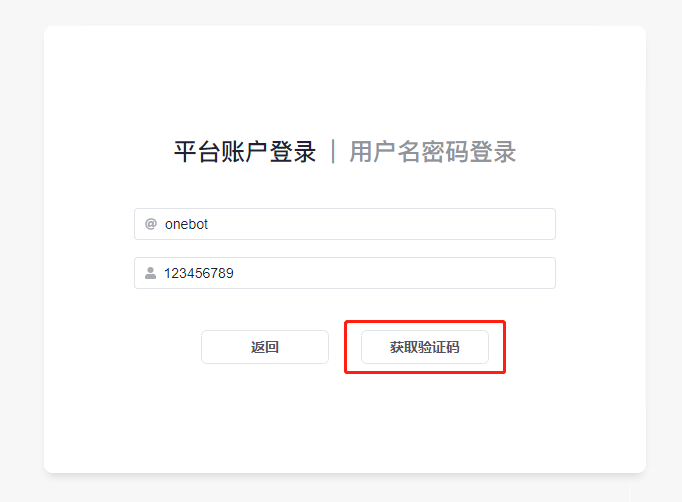
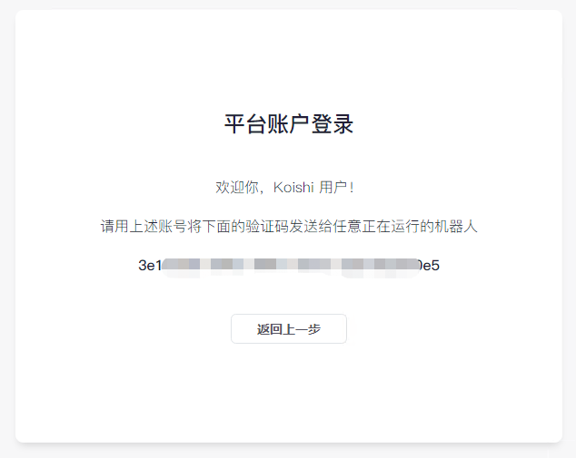
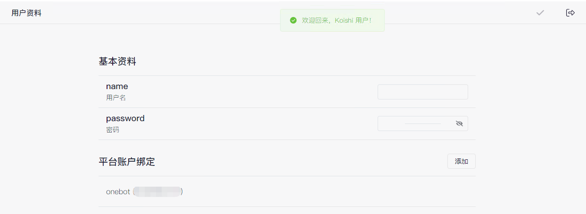

import { FaqPre, FaqPost } from '@site/src/components/FaqCardList'

<FaqPre />

你启用了 `auth` 插件。

auth 插件用于限制 4 级以下权限的用户访问控制台，你可以在文档的「[使用数据库](https://koishi.chat/manual/console/dataview.html)」页面找到设置权限的方法。

如果你的 auth 插件较新，则可能已经内置了初始账号。你可以使用「账号：admin 密码：123456」尝试登录。

如果初始账号无法登录，则需要按照「[如何手动停用插件？](/faq/7)」中的方法停用 auth 插件，随后设置你的账号权限。

正确使用 auth 插件的方法如下：

单击左侧的`平台账户登录`，填入`平台名`与`账号`后单击获取验证码。

平台名为bot运行的平台名称，可以在右下角bot运行信息中获得，如 onebot。

账号为你的账号（而非bot的），例如你的 QQ 号。

若你的填写无误，单击`获取验证码`后将会进入平台账户登录页面。

复制`验证码`并发送至你任意正在运行中的机器人，若操作无误，将会自动登录，并跳转至`用户资料`页面。

现在，你已经登录成功了，浏览器将会记录你的登录信息，下次使用同一个浏览器通常无需再次登录。

你可以在此处设置用于控制台登录的`用户名`与`密码`，并单击右上角的`应用更改`来保存你的设置。

<FaqPost />
