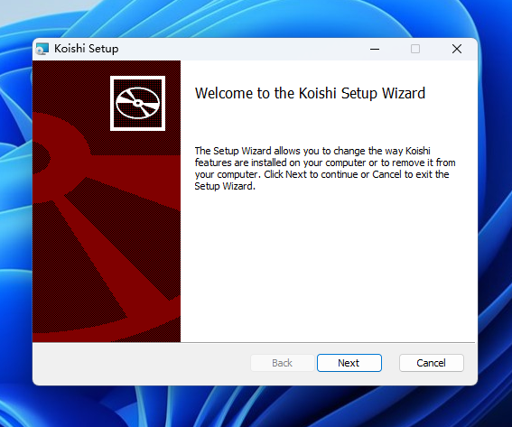
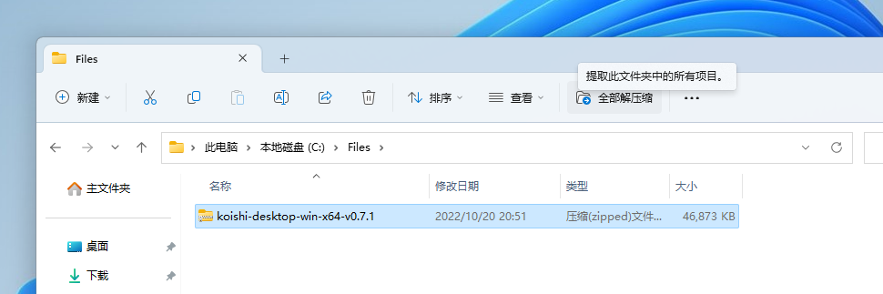
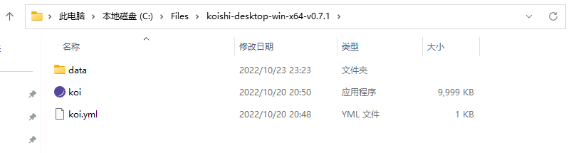
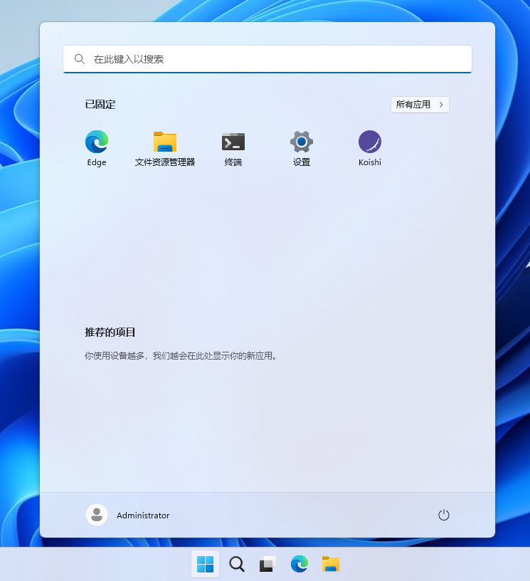

import Tabs from '@theme/Tabs'
import TabItem from '@theme/TabItem'

感谢你选择 Koishi。让我们开始吧。

## 下载

<Tabs groupId="install-method">
<TabItem value="installer" label="安装包（推荐）" default>

  <a
    className="button button--secondary"
    href="http://ghproxy.com/https://github.com/koishijs/koishi-desktop/releases/download/v0.7.3/koishi-desktop-win-x64-v0.7.3.msi"
    target="_blank"
    rel="noopener noreferrer"
  >
    msi 安装包（推荐）
  </a>

通过 msi 安装包安装 Koishi 是最推荐的安装方式，安装程序会自动处理大部分问题。
一般情况下你都应该选择这种方式。

</TabItem>
<TabItem value="portable" label="便携包">

  <a
    className="button button--secondary"
    href="http://ghproxy.com/https://github.com/koishijs/koishi-desktop/releases/download/v0.7.3/koishi-desktop-win-x64-v0.7.3.zip"
    target="_blank"
    rel="noopener noreferrer"
  >
    zip 便携包
  </a>

通过 msi 安装包安装 Koishi 是最推荐的安装方式，但是当你有一些特殊需要时
（比如，希望将 Koishi 置于 U 盘内携带），
你可以使用便携包的方式安装。

</TabItem>
<TabItem value="more" label="更多下载">

  <a
    className="button button--secondary"
    href="https://github.com/koishijs/koishi-desktop/releases"
    target="_blank"
    rel="noopener noreferrer"
  >
    更多下载
  </a>

GitHub Releases 页面里含有更多下载选项，你可以在那里找到 Koishi 的历史版本或其他下载项。

</TabItem>
</Tabs>

## 安装

<Tabs groupId="install-method">
<TabItem value="installer" label="安装包（推荐）" default>

双击 msi 安装包并一路点按「Next」，等待安装过程结束，你便可以在「开始」菜单中找到 Koishi 了。

</TabItem>
<TabItem value="portable" label="便携包">

可以使用你喜欢的解压缩工具解压 Koishi 便携包。
如果你没有安装解压缩工具，使用 Windows 自带的解压缩功能也可完成。

解压完成后，在解压后的文件夹内可以看到「koi」程序，这就是 Koishi 的启动程序了。

</TabItem>
</Tabs>

## 启动

双击 Koishi 图标即可启动。等待几秒钟，你的默认浏览器将会打开 Koishi 控制台，
现在你可以开始使用 Koishi 了。
