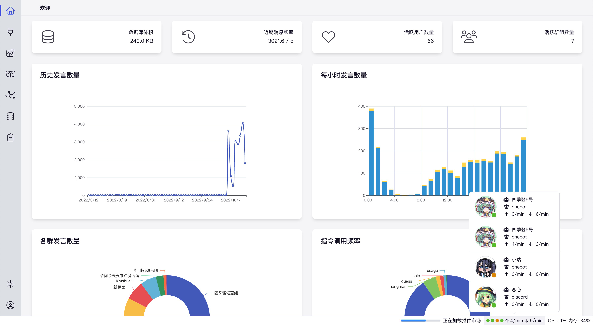
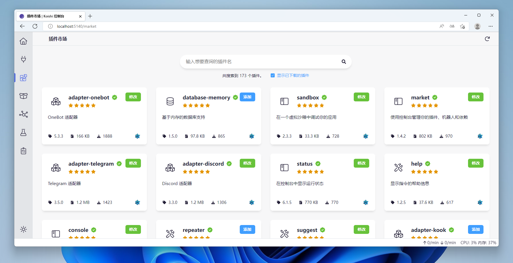
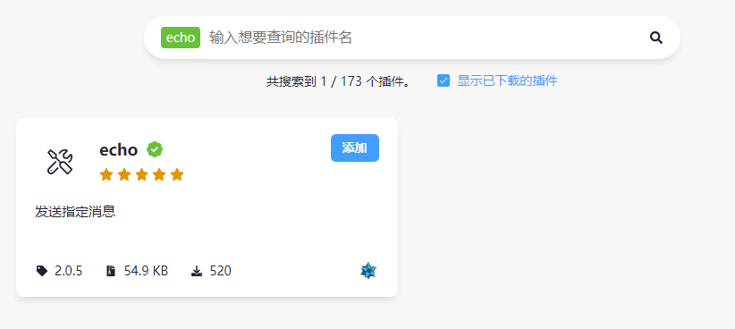
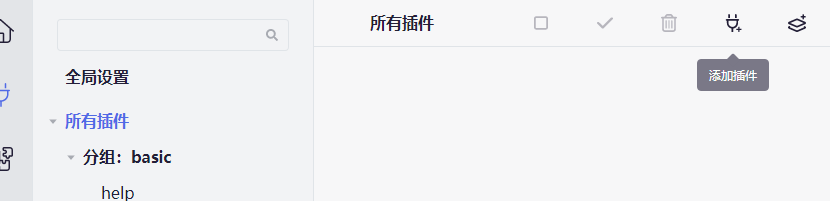
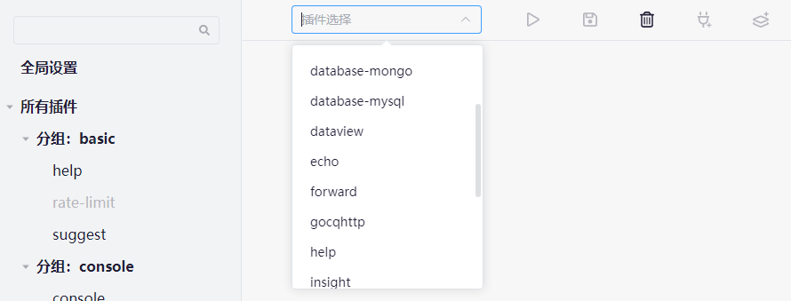
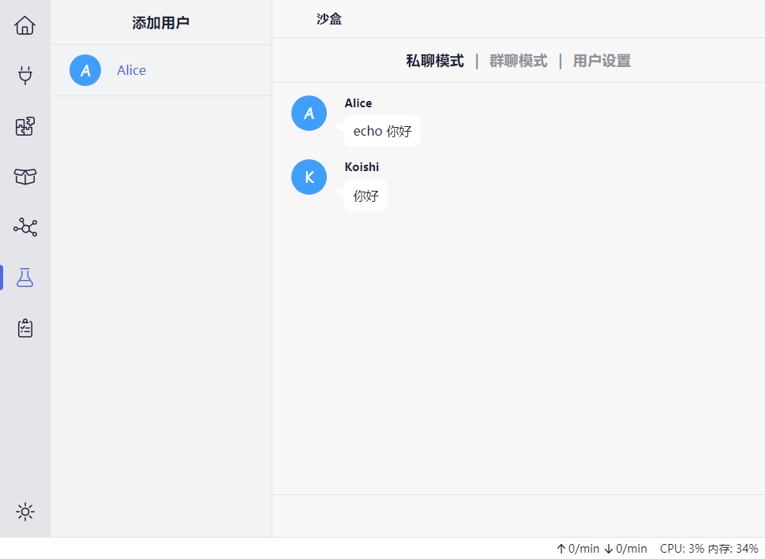

让我们开始吧。

## 检查

在开始之前，确保你已经安装了任意一个版本的 Koishi，并已经启动。

启动 Koishi 之后，你应该可以看到这样的界面：

## 控制台

上面的界面被称为 **Koishi 控制台**。Koishi 控制台就是 Koishi 的用户界面，和其他软件类似，你将在这里完成机器人的所有配置。

Koishi 控制台不仅可以在本地访问，还可以在其他设备的浏览器中打开；[部署控制台](/recipes/4) 中详细说明了操作方法。

## 安装和使用插件

插件是支撑起 Koishi 功能的核心，控制台使用频率最高的功能莫过于安装和配置插件。
接下来，我们先从安装和配置一个名为 `echo` 的插件做起。这个插件的功能非常简单：它只是重复你所说的话。

1. 在控制台的左侧点击「插件市场」，你将在这里看到所有的 Koishi 插件。

2. 输入 `echo` 搜索 echo 插件，并点击安装。

3. 安装完成后，点击左侧的「插件配置」，然后点击右上角的「添加插件」。在出现的下拉框中选择 echo 插件。

4. echo 插件没有任何配置项，我们无需对其进行配置。直接点击「启用插件」。

5. 点击左侧的「沙盒」，点击「添加用户」，在下方的聊天框中输入「echo 你好」。

可以看到机器人成功复读了你所说的内容。

下一步，你可以选择安装和尝试更多的插件；也可以参考后续的配方主题将你的机器人对接到聊天平台。
