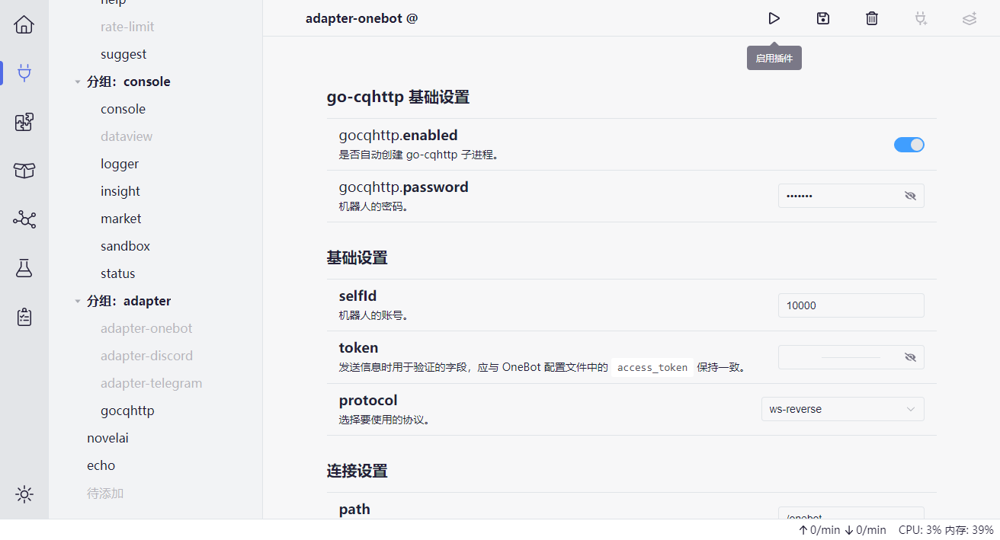
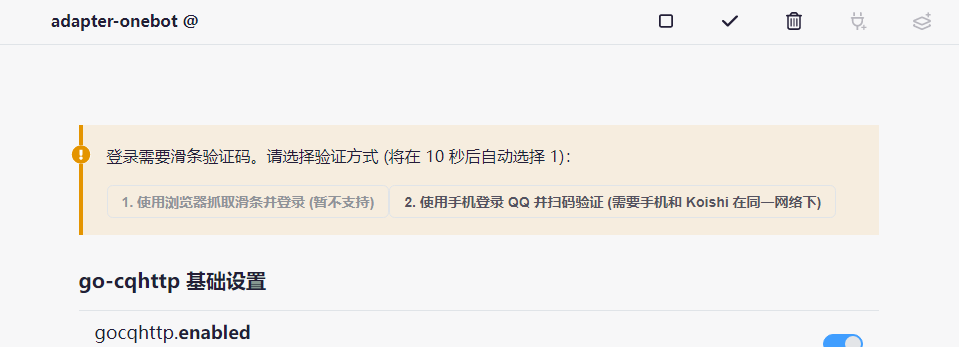

将 Koishi 接入 QQ 不算简单也不算复杂；你需要应对登录时的各种情况，
但幸运的是，你不需要修改配置文件也不需要编写代码，一切都可以在 Koishi 控制台中完成。

## 检查

首先，确保你已经安装了 `@koishijs/plugin-adapter-onebot` 和 `koishi-plugin-gocqhttp` 两个插件；
大多数情况下，这两个插件是默认安装的，并且 `koishi-plugin-gocqhttp` 默认已经启用。
如果 `koishi-plugin-gocqhttp` 尚未被添加或启用，你需要手动启用它。

## 配置

点击控制台左侧的「插件配置」，找到 `@koishijs/plugin-adapter-onebot` 插件；如果没有，那么添加一个。

接着，将「基础设置」的 `protocol` 一项选择 `ws-resverse`，然后打开 `gocqhttp.enabled`，
最后在 `selfId` 一项中输入你的 QQ 号并点击右上角的「启用插件」，如图所示。

## 登录

稍等一下，Koishi 会提示你使用哪种方式登录。可以按照下文的方式逐一尝试。
如果尝试失败了也没有关系；在右上角「停用插件」，然后重新启用即可。

## 使用滑条验证码

如果你所在的网络环境可以打开滑条验证码，那么你可以使用这种方式登录。
在没有登录风险的环境下，这是最便捷的登录方式，因为它不需要扫码或接收验证码。

## 扫码

扫码是最常用的登录方式。Koishi 需要和你扫码的手机位于同一网络环境下。

如果 Koishi 和扫码的手机不在同一网络环境下而导致扫码失败的话，可以试试下面的其他方式。

## 扫码 + 网络隧道

假设你在另外的网络环境内登录，那么你可以先将自己的手机连接到 Koishi 所在的网络，
然后再进行扫码，即可完成登录。

## 扫码 + 配置迁移

如果上述方式都未能成功，那么你可以使用这种方式登录。

1. 首先，在你本地网络的计算机上下载 Koishi 并在本地登录。

2. 登录完成后，关闭 Koishi，然后根据 [这里](/faq/6) 的方法找到实例根目录下的 `accounts` 文件夹；

3. 将 `accounts` 文件夹复制粘贴到远程设备 Koishi 的实例根目录里，覆盖远程设备已有的文件夹；

4. 在远程设备的 Koishi 上重新登录。你应当可以正常登录。
