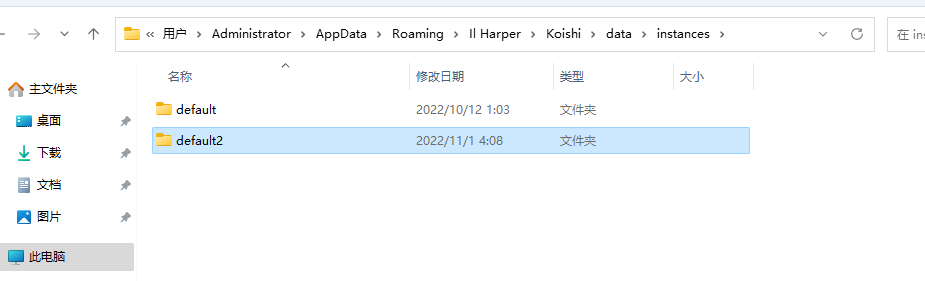
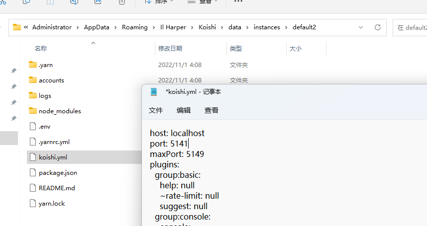
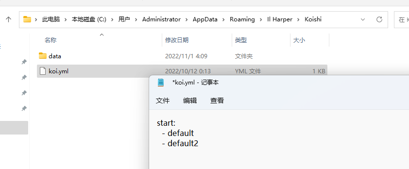

Koishi 桌面支持多实例运行。你可以随意添加多个 Koishi 实例并同时运行它们。

## 打开「实例」文件夹

首先，按照『[「Koishi 配置文件」在哪里？](/faq/6)』中的方法找到当前 Koishi 实例的根目录；
然后，向上导航到「instances」文件夹，这就是 Koishi 桌面的「实例」文件夹了。

## 添加实例

<Tabs groupId="add-method">
<TabItem value="new" label="从整合包创建新实例" default>

在 [这里](https://ghproxy.com/https://github.com/koishijs/boilerplate/releases/download/v1.1.9/boilerplate-v1.1.9-windows-amd64-node16.zip) 下载
Koishi 官方整合包，然后将其解压到 Koishi 桌面的「实例」文件夹内，并重命名一个新名字（比如 `default2`，最好是英文/数字的组合）。

</TabItem>
<TabItem value="clone" label="克隆现有实例">

直接将 Koishi 桌面「实例」文件夹中的 `default`
实例制作一个克隆（复制-粘贴），然后重命名一个新名字（比如 `default2`，最好是英文/数字的组合）。

</TabItem>
</Tabs>

现在，Koishi 桌面的「实例」文件夹应如下所示：

## 配置新实例

打开新实例的配置文件（`koishi.yml`），将 `port` 改一个与现有实例不同的值（比如，`5141`）。

## 配置自启动

如果希望新实例和原来的实例一样自动启动，按照『[「Koishi 桌面」（Koishi Desktop）配置文件在哪里？](/faq/14)』中的方法找到你的
Koishi 桌面配置文件；然后，在配置文件内的 `start` 字段内加上你的新实例。

## 立即启动

在 Koishi 桌面的通知区域图标中选择「高级-刷新」；现在，你可以启动你的新实例了。
