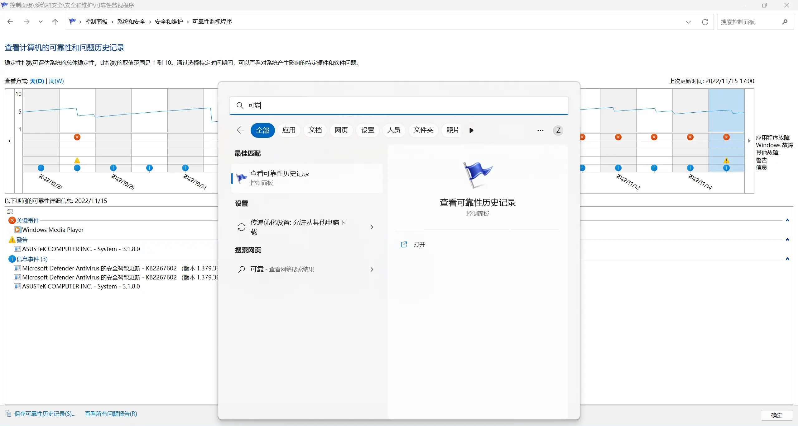

有时，你会在使用 Koishi 的过程中遇到一些「疑难杂症」，并不清楚它们是来自哪里的问题。

如果你具有一些命令行基础，你可以使用这里的方法进行高级诊断。

## 判断问题出自 Koishi 还是 Koishi 桌面

如果控制台窗口能够正常打开，控制台界面能够正常显示，那么此时问题一定出自 Koishi。

如果控制台窗口无法打开，且任务栏图标永远只有「启动」按钮可用，那么问题出自 Koishi。

如果任务栏图标「重启」和「停止」按钮可用（Koishi 已经在运行），但控制台窗口无法打开，或任务栏图标/控制台窗口闪退，那么问题出自 Koishi 桌面。

## 启动命令行

定位到含有 `koi` 程序的文件夹：

- 便携版：根目录
- Windows：`C:/Program Files/Koishi`
- macOS：`/Applications/Koishi.app/Contents/MacOS`

并在此处打开命令行。

## Koishi：重新安装

输入 `koi --debug yarn -n default install --no-lockfile` 并回车，重新安装所有依赖。

如果安装出错，截图并联系我们。

完成后，重启 Koishi 实例，看看问题是否得到解决。

## Koishi 桌面：手动启动

关闭现存的任何 Koishi 桌面程序，然后输入 `koi --debug run daemon` 并回车，启动 Koishi 桌面守护。

另外打开一个命令行，输入 `koi --debug run ui` 并回车，启动 Koishi 桌面界面。

正常操作，并观察它们是否会报错。如果出错，截图并联系我们。

## 查看 Windows 可靠性历史记录

如果你怀疑系统资源不足或是 Windows 问题导致了 koishi 的崩溃。

你可以在 `控制面板\系统和安全\安全和维护\可靠性监视程序` 中找到近 15 天的程序崩溃记录。

检查其中有无与 koishi 相关的信息，如果有，截图并联系我们。

