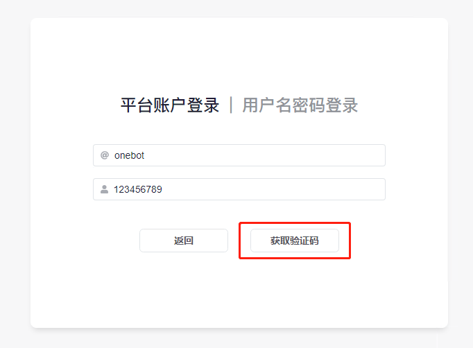

import { RecipePre } from '@site/src/components/Recipes'

<RecipePre />

`auth` 插件可以只允许 4 级以上的用户访问和修改控制台中的配置项。

要启用 `auth` 插件，你需要首先确保任意一个管理员的权限在 4 级以上。如果你在给任何人授权之前误启用了
`auth` 插件，你可以单击右侧的 `用户名密码登录`，使用内置的初始账号：「账号：`admin` 密码：`123456`」尝试登录。

将管理员授权到 4 级以上后，即可使用平台账户进行登录。单击左侧的
`平台账户登录`，填入平台名与账号后单击获取验证码。

平台名为 bot 运行的平台名称，可以在右下角 bot 运行信息中获得。

账号为你的账号（而非 bot 的），要求具有 4 级或以上权限。

以下以 onebot 平台举例。

若你的填写无误，单击 `获取验证码` 后将会进入平台账户登录页面。

将验证码私聊发送至任意正在运行中的机器人（右下角运行中的 bot 之一），若操作无误，将会自动登录，并跳转至用户资料页面。

现在，你已经登录成功了！

你可以手动输入你想要的用户名与密码，之后单击右上角的应用更改，刷新页面，此时你已经可以使用用户名和密码进行登录了。

如果上述登录都失败了，则可以尝试使用「账号：`admin`
密码：`123456`」登录。如果此方法无效，则需要按照「[如何手动停用插件？](/faq/7)」中的方法手动停用 `auth` 插件。
